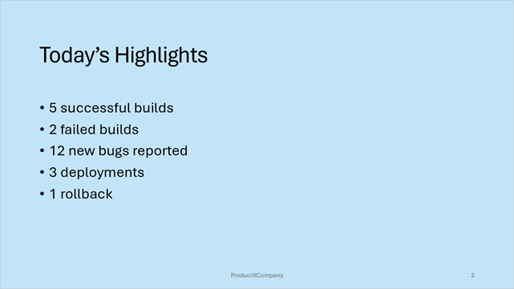
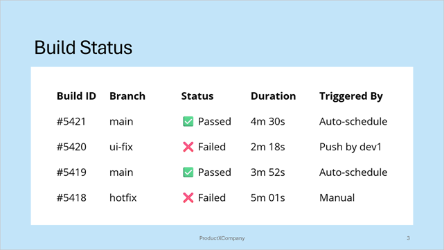

<!-- default badges list -->
[](https://supportcenter.devexpress.com/ticket/details/T1300596)
[](https://docs.devexpress.com/GeneralInformation/403183)
[](#does-this-example-address-your-development-requirementsobjectives)
<!-- default badges end -->


# DevExpress Presentation API Library – Get Started 

This example creates a presentation with three slides and populates them with content.

### Slide #1


### Slide #2



### Slide #3


## Implementation Details

* Use the `Presentation()` parameterless constructor to create a new presentation. 

    ```cs
    Presentation presentation = new Presentation();
    ```
* A newly created presentation contains a single default slide master. The Slide Master is a top-level template slide that you can use as a base for other slides. Slide masters store content, layouts and settings that you can share among derived slides. The default slide master goes first in the `Presentation.SlideMasters` collection.

    ```cs
    SlideMaster slideMaster = presentation.SlideMasters[0];
    ```

* To create a slide, initialize `Slide` objects and add them to the `Presentation.Slides` collection. For each slide, specify the layout type in the `Slide` constructor parameters. In this example, slides get a predefined layout from a slide master. To obtain a layout from the `SlideMaster.Layouts`, you can call the `Get` or `GetOrCreate` method.

    ```cs
    Slide slide1 = new Slide(slideMaster.Layouts.Get(SlideLayoutType.Title));
    //...
    presentation.Slides.Add(slide1);
    ```

* Layouts adds placeholder shapes to slides. You can access placeholder shapes in `Slide.Shapes` collection to add desired content.

    ```cs
    Slide slide1 = new Slide(slideMaster.Layouts.Get(SlideLayoutType.Title));
    foreach (Shape shape in slide1.Shapes) {
        if (shape.PlaceholderSettings.Type is PlaceholderType.CenteredTitle) {
            TextArea textArea = new TextArea();
            textArea.Text = "Daily Testing Status Report";
            shape.TextArea = textArea;
        }
        if (shape.PlaceholderSettings.Type is PlaceholderType.Subtitle) {
            TextArea textArea = new TextArea();
            textArea.Text = $"{DateTime.Now: dddd, MMMM d, yyyy}";
            shape.TextArea = textArea;
        }
    }
    ```
* You can save the resulting presentation to a PPTX file and export it to a PDF file:

    ```cs
    FileStream outputStream = new FileStream(@"..\..\..\data\my-presentation.pptx", FileMode.Create);
    presentation.SaveDocument(outputStream);
    outputStream.Dispose();

    presentation.ExportToPdf(new FileStream(@"..\..\..\data\exported-document.pdf", FileMode.Create));
    ```

## Files to Review

- [Program.cs](./CS/Program.cs) ([Program.vb](./VB/Program.vb))

## Documentation

- [Create Your First Presentation with DevExpress Presentation API Library](https://docs.devexpress.devx/OfficeFileAPI/405404/presentation-api/create-first-presentation)

## More Examples

- [Extract Presentation Images, Notes, and Pictures](https://github.com/DevExpress-Examples/presentation-document-api-extract-content)
<!-- feedback -->
## Does this example address your development requirements/objectives?

[](https://www.devexpress.com/support/examples/survey.xml?utm_source=github&utm_campaign=presentation-api-get-started&~~~was_helpful=yes) [](https://www.devexpress.com/support/examples/survey.xml?utm_source=github&utm_campaign=presentation-api-get-started&~~~was_helpful=no)

(you will be redirected to DevExpress.com to submit your response)
<!-- feedback end -->
